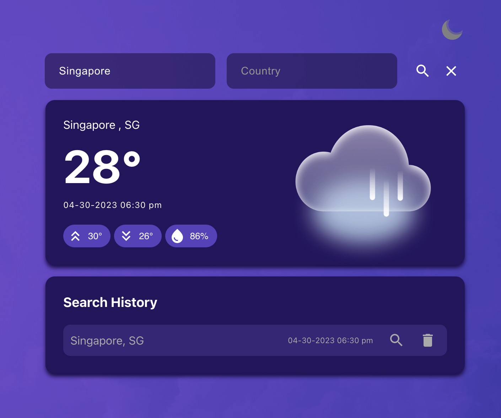
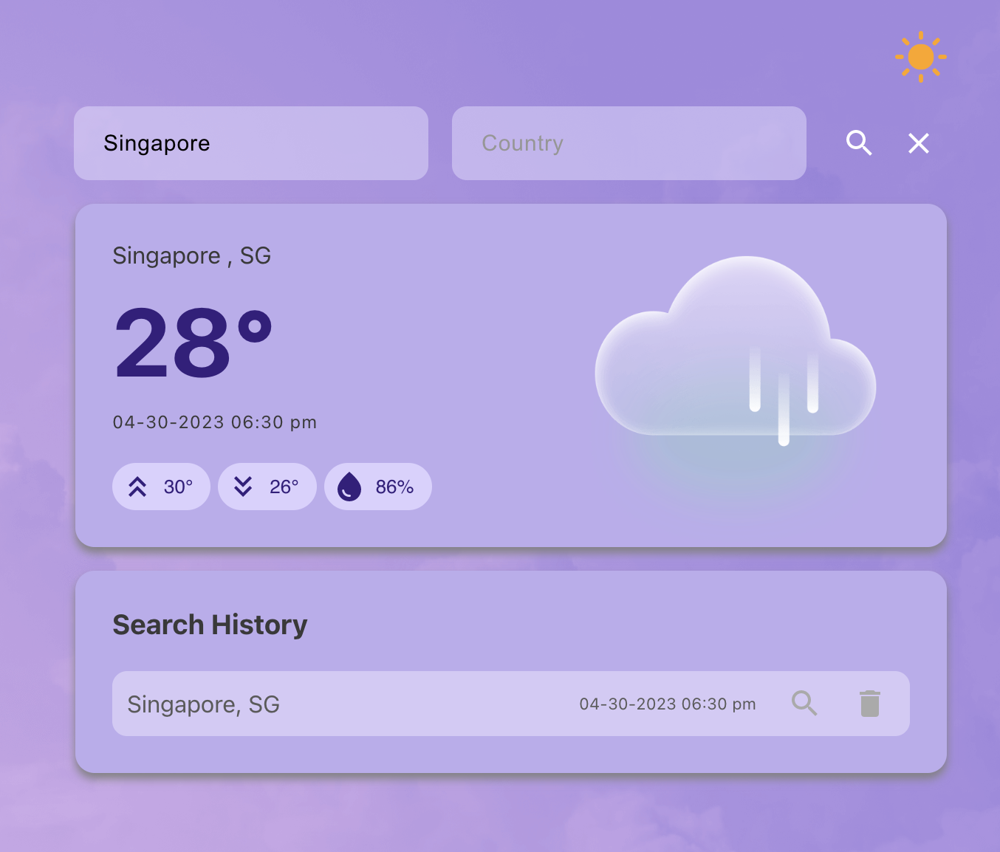

# React Weather Application
React Weather Application is a web application built using ReactJS that allows users to search for weather information in different cities around the world. The app fetches real-time weather data using the OpenWeatherMap API, and displays it in a responsive and user-friendly interface.
<p align="middle">
  
  
</p>

## Features
- Uses the OpenWeatherMap API to fetch weather data in real-time.
- Responsive design that works on desktop and mobile devices.
- Light and dark theme toggle for better user experience.
- Saves user searched location for convenience.
- Includes error handling when a location search is unsuccessful.

## Installation
To get started with the React Weather Application, install it locally using npm:
```bash
# Clone the repository to local machine
$ git clone https://github.com/ongch24014/react-weather-app

# Navigate to the root directory of the project
$ cd react-weather-app

# Install the required dependencies for the project
$ npm install

# Start the development server
$ npm start
```
## How to Use
1. Enter the name of a city or country in the search bar and click the search icon. 
2. The current weather conditions for that city will be displayed.
3. To search for another city, simply enter the details in the search bar and click the search icon again.
4. To search for a previously searched city, simply click on the search icon in the history row.

## Technologies Used
React Weather App was built using the following technologies:
- [ReactJS](https://react.dev/)
- [OpenWeatherMap API](https://openweathermap.org/api)
- [Material UI](https://mui.com/)
